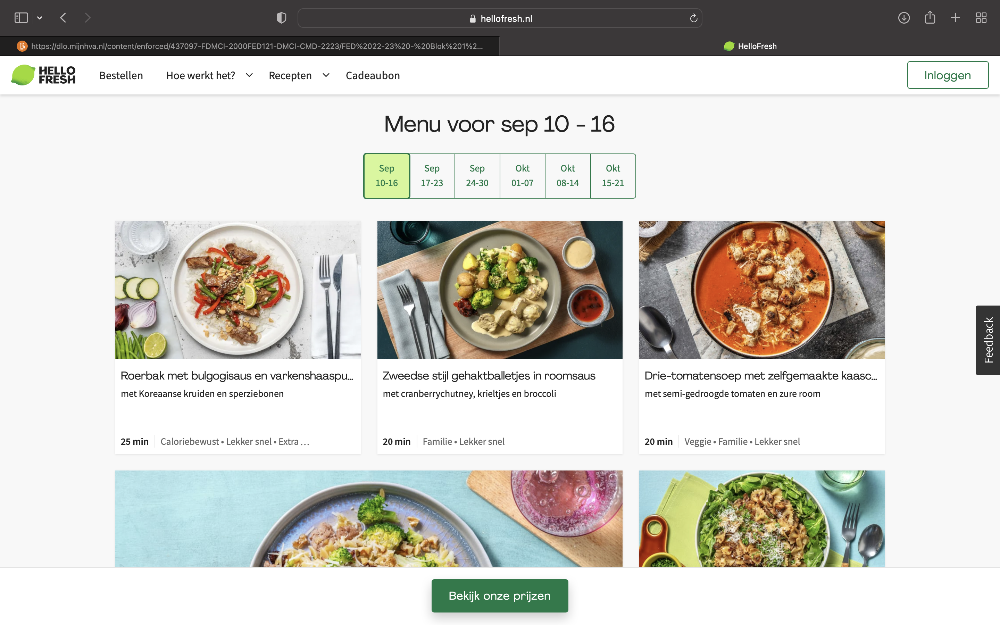
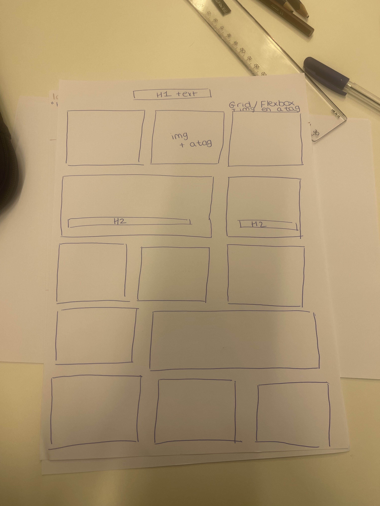
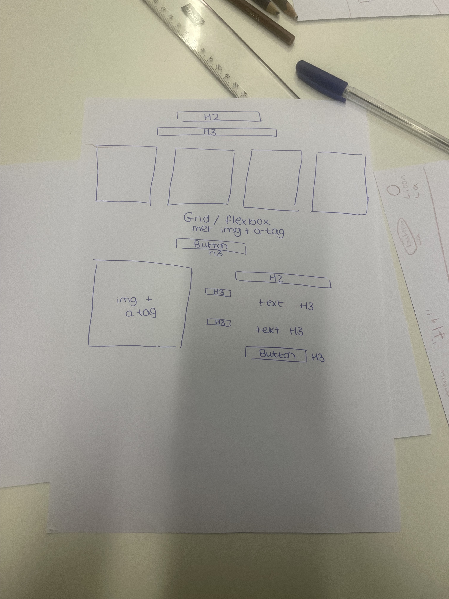
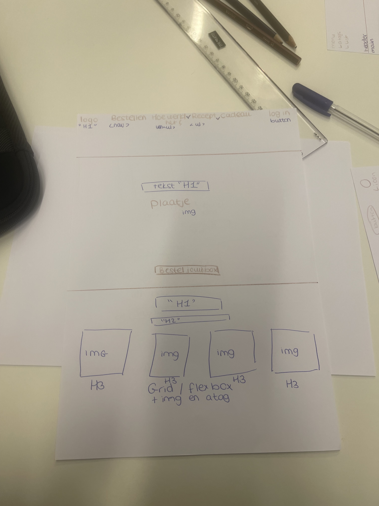

# Procesverslag
Markdown is een simpele manier om HTML te schrijven.  
Markdown cheat cheet: [Hulp bij het schrijven van Markdown](https://github.com/adam-p/markdown-here/wiki/Markdown-Cheatsheet).

Nb. De standaardstructuur en de spartaanse opmaak van de README.md zijn helemaal prima. Het gaat om de inhoud van je procesverslag. Besteedt de tijd voor pracht en praal aan je website.

Nb. Door *open* toe te voegen aan een *details* element kun je deze standaard open zetten. Fijn om dat steeds voor de relevante stuk(ken) te doen.

## Jij

  
uitwerken voor kick-off werkgroep

  ### Auteur:
  Bibi van Beurden 

  #### Je startniveau:
  Blauwe piste  

  #### Je focus:
  Voor nu responsive
 

## Je website

  
uitwerken voor kick-off werkgroep

  ### Je opdracht:
  https://www.hellofresh.nl

  #### Screenshot(s) van de eerste pagina (small screen): 
 homepagina 
  

  #### Screenshot(s) van de tweede pagina (small screen):
  op het menu 
  
 

## Toegankelijkheidstest 1/2 (week 1)
x

  
uitwerken na test in 1e werkgroep

  ### Bevindingen
  Lijst met je bevindingen die in de test naar voren kwamen:
  - rechterhelft word geblokkeerd.
  - Ik kan de website voor 90% zien. 
  - Sommige stukken zal je met je hoofd moeten draaien.
  - De website is goed voor mensen met deze beperking.

  #### Screenreader
 De voiceover op mijn mac is makkelijk te activeren. Toen ik voor de eerste keer mijn voiceover ging gebruiken. Verbaasde ik mij erover dat hij alles voorleest waar jij naar kijkt, zelfs de onnodige dingen. Dit ging voor mij echt heel snel.  

Door dit op te lossen is een goede semantische html belangrijk. Een goede semantische html helpt de screenreaders om het beter te lezen en vervolgens beter voor de lezen voor de gebruiker. OOk is het belangrijk dat je niet alles voorgelezen krijgt maar de juiste dingen die de gebruiker wilt horen.

  #### Muis en Toetsenbord 
  Ik merk dat dit een groot opstakel is. Het is erg lastig om door de website heen te gaan. Je kan wel verder naar andere paginas maar het is niet mogelijk om dan weeer naar het hoofdmenu te gaan. Dit zal voor de gebruiker een groot opstakel zijn.

Er moet een goede site worden gemaakt die ook goed is voor mensen met deze beperking. Je moet overal heen kunnen zonder dat je de muis hoeft te gebruiken, zowel het hoofdmenu.

  #### Motoriek (shocks, elastiekjes)
Ik kon met de elastiekjes moeilijk scrollen met de muis. Ook heb ik de schock gebruikt en dit voelde naar. Dit is echt een beperking wat lastig is om de website te

  Hier een omschrijving van hoe het opgelost kan worden (met indien nodig afbeeldingen)
  De website moet ook voor deze mensen te gebruiken zijn.

  #### Visueel (brillen, contrast, kleurenblind, dark/light). 
  Voor de visueele oefening heb ik blur gebruikt als beperking. Je zag de website moeilijker. Dit is erg vervelend voor de gebruiker. Zo kan je het niet goed besturen en weet je niet waar je heen moet.

  Hier een omschrijving van hoe het opgelost kan worden
  Dit moet goed aangepat worden voor mensen met deze beperking.

## Breakdownschets (week 1)

  
uitwerken na afloop 2e werkgroep

  ### de hele pagina: 
  

  ### dynamisch deel (bijv menu): 
  

  ### wellicht nog een dynamisch deel (bijv filter): 
  

## mini_symposium verslag Week 1:
Vandaag hebben we een hoorcollege gehad over verschillende dingen. Over het algemeen ging het over hoe je een website kan maken voor mensen met een beperking. We kregen een uitleg van een man uit Wenen die vertelde hoe je een html code goed moet indelen en benamen zodat de screenreaders het goed kunnen lezen. Ook kwam er een man die een beperking heeft en daardoor veel dingen niet kan doen. Hij vertelde dat minor studenten een ontwerp had gemaakt voor hem zodat hij met zijn beperking toch muziek kan spelen. Dit vond ik heel erg intresssant en leuk om te weten en dit gaf mij inspiratie.

## Voortgang 1 (week 2)

  
uitwerken voor 1e voortgang

  ### Stand van zaken
  hier dit ging goed & dit was lastig (neem ook screenshots op van delen van je website en code)

  ### Agenda voor meeting
  samen met je groepje opstellen

  | student 1      | student 2          | student 3    | student 4        |
  | ---            | ---                | ---          | ---              |
  | dit bespreken  | en dit             | en ik dit    | en dan ik dat    |
  | en dat ook nog | dit als er tijd is | nog een punt | dit wil ik zeker |
  | ...            | ...                | ...          | ...              |

  ### Verslag van meeting
  hier na afloop snel de uitkomsten van de meeting vastleggen

  - punt 1
  - punt 2
  - nog een punt
  - ...

## Voortgang 2 (week 3)

  
uitwerken voor 2e voortgang

  ### Stand van zaken
  hier dit ging goed & dit was lastig (neem ook screenshots op van delen van je website en code)

  ### Agenda voor meeting
  samen met je groepje opstellen

  | student 1      | student 2          | student 3    | student 4        |
  | ---            | ---                | ---          | ---              |
  | dit bespreken  | en dit             | en ik dit    | en dan ik dat    |
  | en dat ook nog | dit als er tijd is | nog een punt | dit wil ik zeker |
  | ...            | ...                | ...          | ...              |

  ### Verslag van meeting
  hier na afloop snel de uitkomsten van de meeting vastleggen

  - punt 1
  - punt 2
  - nog een punt
- ...

## Toegankelijkheidstest 2/2 (week 4)

  
uitwerken na test in 8e werkgroep

  ### Bevindingen
  Lijst met je bevindingen die in de test naar voren kwamen (geef ook aan wat er verbeterd is):

  #### Screenreader
  Hier korte omschrijving (met indien nodig afbeeldingen)

  Hier een omschrijving van hoe het opgelost kan worden (met indien nodig afbeeldingen)

  #### Muis en Toetsenbord 
  Hier korte omschrijving (met indien nodig afbeeldingen)

  Hier een omschrijving van hoe het opgelost kan worden (met indien nodig afbeeldingen)

  #### Motoriek (shocks, elastiekjes)
  Hier korte omschrijving (met indien nodig afbeeldingen)

  Ik kon met de elastiekjes moeilijk scrollen met de muis. Ook heb ik de schock gebruikt en dit voelde naar. Dit is echt een beperking wat lastig is om de website te

  Hier een omschrijving van hoe het opgelost kan worden (met indien nodig afbeeldingen)

  #### Visueel (brillen, contrast, kleurenblind, dark/light). 
  Hier korte omschrijving (met indien nodig afbeeldingen)

  Hier een omschrijving van hoe het opgelost kan worden (met indien nodig afbeeldingen)

## Voortgang 3 (week 4)

  
uitwerken voor 3e voortgang

  ### Stand van zaken
  hier dit ging goed & dit was lastig (neem ook screenshots op van delen van je website en code)

  ### Agenda voor meeting
  samen met je groepje opstellen

  | student 1      | student 2          | student 3    | student 4        |
  | ---            | ---                | ---          | ---              |
  | dit bespreken  | en dit             | en ik dit    | en dan ik dat    |
  | en dat ook nog | dit als er tijd is | nog een punt | dit wil ik zeker |
  | ...            | ...                | ...          | ...              |

  ### Verslag van meeting
  hier na afloop snel de uitkomsten van de meeting vastleggen

  - punt 1
  - punt 2
  - nog een punt
  - ...

## Eindgesprek (week 5)

  
uitwerken voor eindgesprek

  ### Je uitkomst - karakteristiek screenshots:
  

  ### Dit ging goed/Heb ik geleerd: 
  Korte omschrijving met plaatjes

  

  ### Dit was lastig/Is niet gelukt:
  Korte omschrijving met plaatjes

  

## Bronnenlijst

  
continu bijhouden terwijl je werkt

  Nb. Wees specifiek ('css-tricks' als bron is bijv. niet specifiek genoeg).

  1. bron 1
  2. bron 2
  3. ...

