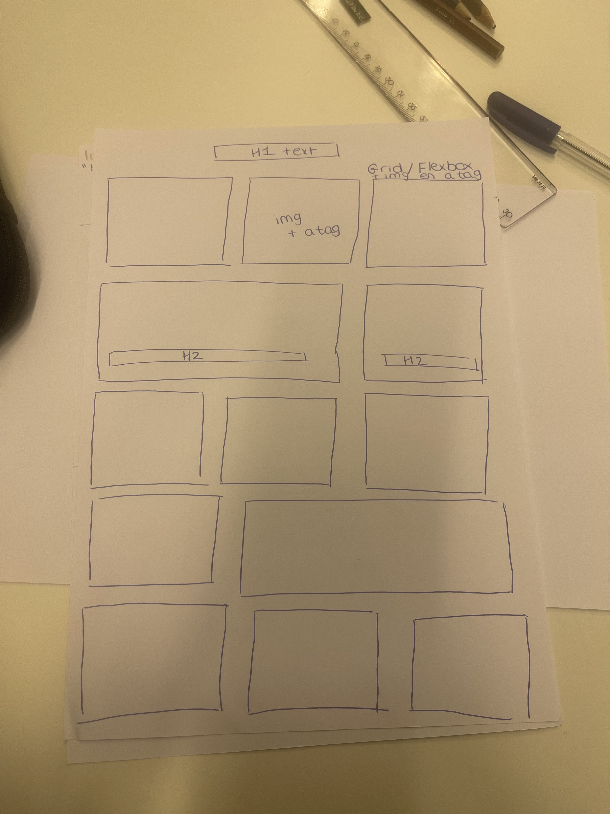

# Procesverslag
Markdown is een simpele manier om HTML te schrijven.  
Markdown cheat cheet: [Hulp bij het schrijven van Markdown](https://github.com/adam-p/markdown-here/wiki/Markdown-Cheatsheet).

Nb. De standaardstructuur en de spartaanse opmaak van de README.md zijn helemaal prima. Het gaat om de inhoud van je procesverslag. Besteedt de tijd voor pracht en praal aan je website.

Nb. Door *open* toe te voegen aan een *details* element kun je deze standaard open zetten. Fijn om dat steeds voor de relevante stuk(ken) te doen.

## Jij

  
uitwerken voor kick-off werkgroep

  ### Auteur:
  Bibi van Beurden 

  #### Je startniveau:
  Blauwe piste  

  #### Je focus:
  Voor nu responsive
 

## Je website

  
uitwerken voor kick-off werkgroep

  ### Je opdracht:
  https://www.hellofresh.nl

  #### Screenshot(s) van de eerste pagina (small screen): 
 homepagina 
  

  #### Screenshot(s) van de tweede pagina (small screen):
  op het menu 
  
 

## Toegankelijkheidstest 1/2 (week 1)
x

  
uitwerken na test in 1e werkgroep

  ### Bevindingen
  Lijst met je bevindingen die in de test naar voren kwamen:
  - rechterhelft word geblokkeerd.
  - Ik kan de website voor 90% zien. 
  - Sommige stukken zal je met je hoofd moeten draaien.
  - De website is goed voor mensen met deze beperking.

  #### Screenreader
 De voiceover op mijn mac is makkelijk te activeren. Toen ik voor de eerste keer mijn voiceover ging gebruiken. Verbaasde ik mij erover dat hij alles voorleest waar jij naar kijkt, zelfs de onnodige dingen. Dit ging voor mij echt heel snel.  

Door dit op te lossen is een goede semantische html belangrijk. Een goede semantische html helpt de screenreaders om het beter te lezen en vervolgens beter voor de lezen voor de gebruiker. OOk is het belangrijk dat je niet alles voorgelezen krijgt maar de juiste dingen die de gebruiker wilt horen.

  #### Muis en Toetsenbord 
  Ik merk dat dit een groot opstakel is. Het is erg lastig om door de website heen te gaan. Je kan wel verder naar andere paginas maar het is niet mogelijk om dan weeer naar het hoofdmenu te gaan. Dit zal voor de gebruiker een groot opstakel zijn.

Er moet een goede site worden gemaakt die ook goed is voor mensen met deze beperking. Je moet overal heen kunnen zonder dat je de muis hoeft te gebruiken, zowel het hoofdmenu.

  #### Motoriek (shocks, elastiekjes)
Ik kon met de elastiekjes moeilijk scrollen met de muis. Ook heb ik de schock gebruikt en dit voelde naar. Dit is echt een beperking wat lastig is om de website te

  Hier een omschrijving van hoe het opgelost kan worden (met indien nodig afbeeldingen)
  De website moet ook voor deze mensen te gebruiken zijn.

  #### Visueel (brillen, contrast, kleurenblind, dark/light). 
  Voor de visueele oefening heb ik blur gebruikt als beperking. Je zag de website moeilijker. Dit is erg vervelend voor de gebruiker. Zo kan je het niet goed besturen en weet je niet waar je heen moet.

  Hier een omschrijving van hoe het opgelost kan worden
  Dit moet goed aangepat worden voor mensen met deze beperking.

## Breakdownschets (week 1)

  
uitwerken na afloop 2e werkgroep

  ### de hele pagina: 
  

  ### dynamisch deel (bijv menu): 
  

  ### wellicht nog een dynamisch deel (bijv filter): 
  

## mini_symposium verslag Week 1:
Vandaag hebben we een hoorcollege gehad over verschillende dingen. Over het algemeen ging het over hoe je een website kan maken voor mensen met een beperking. We kregen een uitleg van een man uit Wenen die vertelde hoe je een html code goed moet indelen en benamen zodat de screenreaders het goed kunnen lezen. Ook kwam er een man die een beperking heeft en daardoor veel dingen niet kan doen. Hij vertelde dat minor studenten een ontwerp had gemaakt voor hem zodat hij met zijn beperking toch muziek kan spelen. Dit vond ik heel erg intresssant en leuk om te weten en dit gaf mij inspiratie.

## Voortgang 1 (week 2)

  
uitwerken voor 1e voortgang

  ### Stand van zaken
  In week 2 hadden we de eerste voortgang gesprek. Ik kwam hier vooral met vragen over mijn menu en hiermee heeft student assistent mij mee geholpen. We hadden niet genoeg tijd hiervoor en ging uiteindelijk zelf verder met mijn vordering van mijn website van Hello Fresh. Ik merkte dat ik alles weer een beetje op moest halen na zon lange vakantie maar gelukkig konden de mensen die daar waren mij verder helpen.

  ### Agenda voor meeting
  samen met je groepje opstellen

  | student 1      | student 2          | student 3    | student 4        |
  | ---            | ---                | ---          | ---              |
  | dit bespreken  | en dit             | en ik dit    | en dan ik dat    |
  | en dat ook nog | dit als er tijd is | nog een punt | dit wil ik zeker |
  | ...            | ...                | ...          | ...              |

  ### Verslag van meeting
  hier na afloop snel de uitkomsten van de meeting vastleggen

  - Menu stijlen 
  - Eerste codes laten checken
  - Semantische code gebruik

## Voortgang 2 (week 3)

  
uitwerken voor 2e voortgang

  ### Stand van zaken
  Hier was mijn site al verder en was mijn menu gelukt! Wel had ik vragen over een scrollbar en heb ik dit gevraagd. Ook heb ik gevraagd om verschillende manieren van styling. Hier konden ze mij goed mee helpen.

  ### Agenda voor meeting
  samen met je groepje opstellen

  | student 1      | student 2          | student 3    | student 4        |
  | ---            | ---                | ---          | ---              |
  | dit bespreken  | en dit             | en ik dit    | en dan ik dat    |
  | en dat ook nog | dit als er tijd is | nog een punt | dit wil ik zeker |
  | ...            | ...                | ...          | ...              |

  ### Verslag van meeting
  hier na afloop snel de uitkomsten van de meeting vastleggen

  - scrollbar
  - Semantische code
  - Vragen

## Toegankelijkheidstest 2/2 (week 4)

  
uitwerken na test in 8e werkgroep

  ### Bevindingen
  Ik kwam erachter dat mijn website redelijk toegangelijk is. Hij komt bij alle buttons en maar niet bij de h1&h2 en die slaat die over.

  #### Screenreader
  Mijn website ging goed met screenreaders. Hij ging over bijna alle content. Het is dus toegeangelijk voor mensen met een beperking. ik merkte in de vorige testen dat dit niet kon bij de hello fresh site. Ik heb dit wederom opgelost.

  #### Muis en Toetsenbord 
  Ik merk dat dit een groot opstakel was bij andere sites. Wederom heb ik er voor gezorgd dat je makkelijk met tap en enter over de site te gaan is. Je komt bijna overal behalve op sommige content. Maar de belangerijkste dingen zijn zichtbaar en klikbaar.

  Er moet een goede site worden gemaakt die ook goed is voor mensen met deze beperking. Je moet overal heen kunnen zonder dat je de muis hoeft te gebruiken, zowel het hoofdmenu.

  #### Motoriek (shocks, elastiekjes)
  Ik kon met de elastiekjes moeilijk scrollen met de muis. Ook heb ik de schock gebruikt en dit voelde naar. Dit is echt een beperking wat lastig is om de website. Dit is over het algemeen em ligt niet aan mijn website. 

  #### Visueel (brillen, contrast, kleurenblind, dark/light). 
  Voor de visueele oefening heb ik blur gebruikt als beperking. Het is moeilijk om de website te visualiseren, het word een beetje wazig. Maar voor de rest is de website nog goed bestuurbaar ook voor mensen met deze beperking.

## Voortgang 3 (week 4)

  
uitwerken voor 3e voortgang

  ### Stand van zaken
  In de laatste week heb ik mij vooral gefocust over de laatste vragen die ik had over mijn site om verder te gaan en af te ronden. 

  ### Agenda voor meeting
  samen met je groepje opstellen

  | student 1      | student 2          | student 3    | student 4        |
  | ---            | ---                | ---          | ---              |
  | dit bespreken  | en dit             | en ik dit    | en dan ik dat    |
  | en dat ook nog | dit als er tijd is | nog een punt | dit wil ik zeker |
  | ...            | ...                | ...          | ...              |

  ### Verslag van meeting
  Hier na afloop snel de uitkomsten van de meeting vastleggen

  -   Laatste vragen
  -   Vragen of de codes goed staan
  -   Vragen over foutmelding

## Eindgesprek (week 5)

  
uitwerken voor eindgesprek

  ### Je uitkomst - karakteristiek screenshots:
  

  ### Dit ging goed/Heb ik geleerd: 
  Ik merkte dat het coderen mij in de eerste weken best mooeilijk af ging. Wel heb ik gebruik gemaakt van de student assisenten en heb ik met een medeklasgenoot afgesproken,vaak na school. Zo konden we vragen stellen en elkaar helpen. In het verloop had ik er best lol in en merkte dat ik het best leuk 
  begin te vinden. Het kost veel moeite met vallen en opstaan, maar ondanks dat ben ik wel echt trots op het einde resultaat. 

  Ik vond het best een uitdaging om de officele website na te maken maar dan met een betere semantische code. Ik vond het eerst erg spannend. Het ging vooral om de pagina met de verschillende recepten. Daar moest je gebruik maken van grid en toen ik dat voor het eerste hoorde dacht ik echt van "hoe ga ik dit doen".En ik dacht dat dit mij niet ging lukken. Dus ben trots op het feit dat mijn site staat en dat het gelukt is met grid.

  Ik heb weer meer geleerd over de html en css en merkte dat het echt veel handiger is om CSS propeties te gebruiken. Zo scheelt het heel wat typ werk. Dit ga ik zeker in het vervolg gebruiken.

  ### Dit was lastig/Is niet gelukt:
  Ik gaf al bij mij top aan dat ik trots was op mijn site en dat het uiteindelijk allemaal is gelukt. Als je echt gaat kijken dan had ik nog wel bij de recepten 
  mijn grid willen uitwerken. Op de officiele site is dan ook te zien dat je verschillende recepten hebt in verschillende grotes. Dit is mij helaas niet gelukt het staat er alsnog mooi maar als ik meer tijd had gehad, had ik mij hier zeker in verdiept.

  Als ik sowieso meer tijd had gehad, had ik meerdere dingen toegevoegd maar die tijd was er niet altijd.

  

## Bronnenlijst

  
continu bijhouden terwijl je werkt

 Mijn Bronnenlijst is te vinden bij de codes. Staat netjes bij wat ik waar vandaan heb met de juiste link.

